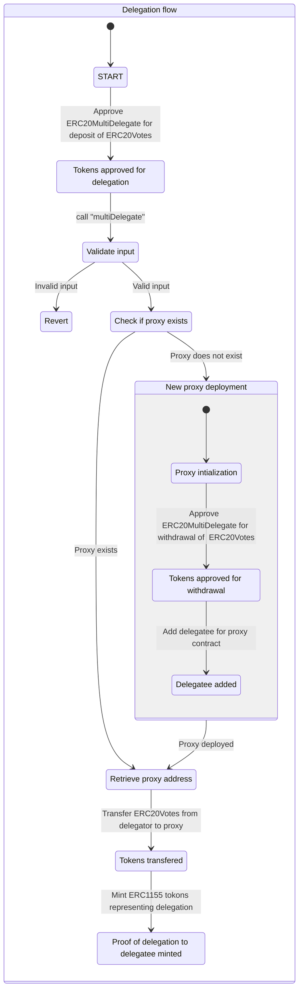
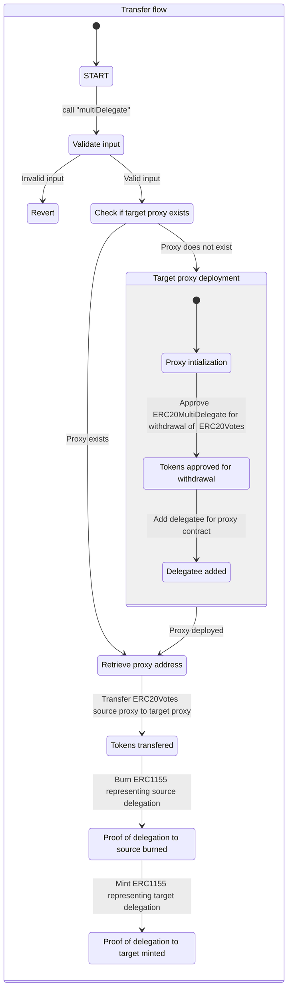
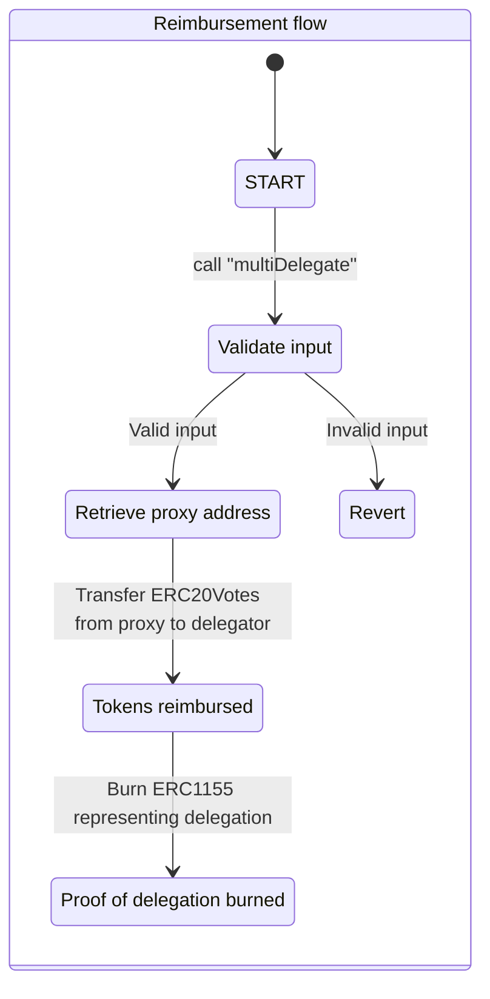

## Analysis summary
The `ERC20MultiDelegate` contract was analysed for common design flaws, such as access control, arithmetic issues, front-running, denial of service, race conditions, and protocol manipulations. 

Following attack vectors were analysed:
### 1. Can the contract be reentered via `ERC1155` callback?
Reentrancy is possible via `ERC1155` callback. However, the contract correctly implements check-effects-interaction pattern. 
### 2. Is it possible for an attacker to take control of the proxy contracts?
The proxy contracts do not implement any ownership mechanism, and do not expose public facing APIs. Approval of custody-`ERC20Votes` token is implemented correctly. 
### 3. Is it possible to steal `ERC20Votes` of other accounts?
Proof of delegations is correctly checked before withdrawal or transfer of voting rights. 
### 4. Is it possible to prevent delegators from withdrawing their rightful delegations?
Unauthorized burning for a delegators `ERC1155` tokens are required to prevent them from withdrawing their tokens.  `ERC1155` implementation prevents this from happening. It is still possible for a delegator loose access to their `ERC20Vote` tokens if they accidentally burn their own `ERC1155` tokens. This scenario, however, does not impact other users or the system as a whole.
### 5. Is it possible to forge proof of delegation?
The ability to mint arbitrary `ERC1155` tokens is not exposed by the contract.
### 6. Does withdrawal resets the state correctly? Is it possible to replay withdrawal?
Withdrawal correctly transfers the delegated amount to the delegate and burns the proof of delegation preventing replay attacks.
### 7. Can the proxy creation be influenced?
The creation of proxy contract is contained within the private function `deployProxyDelegatorIfNeeded`. The function depends on the delegatee address that can be controlled by external actors. But manipulating this input does not seem to impact the security of the proxy contract. An incorrect target address may however cause the delegatee to loose access to the voting power. Still `ERC20Votes` can, however, be withdrawn by the contract correctly.
### 8. Are there are any edge case transactions which may result in undefined behavior?
Boundary conditions like delegating to same accounts and transferring between the same is handled correctly.
### 9. Does the contract handles zero input and failures correctly?
Contract rejects the transaction if no source and target is present for a delegation. If the amount is zero, a zero amount transfer correctly takes place.
### 10. Are there any centralization risks present?
The contract implements the OpenZeppelin `Ownable` library. However:
- The contract is not upgradeable by the owner.
- The contract is not pausable by the owner.
- The contract assets cannot arbitrarily locked by the owner.

The team behind the contract is publicly known and can be held accountable for malpractices. 
### 11. What happens if the proof of delegation mechanism fails during delegations? 
If verification of proof of delegation does not succeed during transfer or withdrawal, the transaction reverts. If minting or burning `ERC1155` token fails for any reason, the transaction reverts as expected.
### 12. Is it possible to inflate voting power?
The voting power accounting is handled correctly by `ERC20Voting` contract.
### 13. Is authorization handled correctly? Is it possible to transfer delegations on behalf of the delegator?
Proof of delegation is correctly checked before transferring delegations, preventing impersonation attacks.
### 14. Are there any front running risks?
There correct operation of this contract does not seem to depend on transaction order.
### 15. Are there any arithmetic errors / precision loss ?
Contract does not seem to have arithmetic errors or precision loss. The requested amount is acted upon without any manipulation by the contract.
## Protocol overview
ENS DAO is a DAO that governs the ENS protocol. The ENS governance token, implemented as `ERC20Votes` from OpenZeppelin, provides support for voting and delegation, similar to compound protocol. 

The governance protocol allows an account to delegate its full voting power to a "delegatee", that may pool delegated voting power from several accounts and can then use it to vote on governance proposals. The current limitation is that an account can delegate their full voting power to exactly one delegate.

`ERC20MultiDelegate` contract aims to overcome this limitation by:
1. Providing the ability to nominate multiple OpenZeppelin.
2. Providing granular control on the amount to be delegated.
## Architecture overview
The protocol architecture is designed to the following fundamental goals:
 1.  Keep track of delegations across all account.
 2. Support multiple delegations without transferring the underlying `ERC20Votes` to the delegatee. 
### `ERC1155` as proof of delegation
The contract is implemented as a `ERC1155` token to keep track of delegations. This allows the contract to be lean by offloading book keeping logic to the standard implemented by the OpenZeppelin library. Additionally it has the following advantages:
1. Ownership of delegation can be transferred without  need for re delegating the underlying voting power.
2. This contract can plugin into the rich ecosystem that supports `ERC1155` standard for composable applications.
### Proxy ownership of `ERC20Votes` tokens
`ERC20MultiDelegate` deploys a unique proxy contract to take ownership of the `ERC20Votes` token during the period of delegation while delegating voting rights to the target delegatee. 

The proxy also approves `ERC20MultiDelegate` contract so that withdrawal of the underlying voting tokens can be executed anytime. 

Since the contract uses predictable proxy addresses using `CREATE2`, the same proxy can be deployed once and re-used for the the same delegatee.
### Protocol invariants
1. Only The delegator MUST be able to withdraw their delegated voting power at any time.
2. The number of tokens delegated for a delegator-delegatee pair must equal to the total number of `ERC1155` minted minus number of `ERC1155` burned, where the `tokenId` the address of the deleagee account.
3. Total number of `ERC1155` tokens minted minus total `ERC1155` burned MUST be equal to total number of votes delegated across all delegators.
### Delegation types
`ERC20MultiDelegate` supports delegation to multiple account(s), transfer of delegation(s) from source account(s) to target account(s), and withdrawing of existing delegation(s). The type of delegation is based on the input given to `multiDelegate` function as list of sources, targets, and amounts in matching order.

Each source and target pair is checked against the following cases to determine the type of delegation:

| Case                                           | Action                                                 |
|------------------------------------------------|--------------------------------------------------------|
| Delegation has a source has no target account. | Voting power of the source acccount is reimbursed.     |
| Delegation has a target but no source account. | Voting power is sourced from msg.sender (delegator).   |
| Delegation has both source and target account. | Voting delegation settled via inter-delegate transfer. |

#### Delegation
To delegate, first the delegator approves the `ERC20MultiDelegate` contract for transfer of `ERC20Vote` tokens and also nominates a delegatee. `ERC20MultiDelegate` deploys a proxy contract which in turn takes custody of the `ERC20Vote` and delegates voting rights to the delegatee. Finally, the `ERC20MultiDelegate` contract mints `ERC1155` tokens corresponding to the delegated voting power as proof of delegation to the delegator,  where the token id is the address of the delegatee.

#### Transfer delegation
The delegator nominates a target account along with the source account from which the voting power should be transferred. `ERC20MultiDelegate` deploys a  target proxy contract, if not already deployed, which takes custody of the `ERC20Vote` from the source proxy.  Lastly, the `ERC1155` tokens indicating delegation to source proxy is burned and new tokens are minted against the delegation for target account.

#### Reimbursement
The delegator specifies the source account from which the delegation should be revoked. `ERC20MultiDelegate` transfers the `ERC20Vote` from the source proxy to delegator and burns the the associated `ERC1155` tokens.

## Recommendations for further development
### Keep an eye out for reentrancy
When updating this codebase ensure to follow check-interaction-pattern to avoid reentrancy via `ERC1155` callback. It is recommended to use a reentrancy guard to prevent reentrancy from happening.
### Consider separation of concerns in protocol design
The `multiDelegate` function handles several types of transactions such as creation of a new delegation, transfer of existing delegation, and withdrawal of existing delegation. This makes the function a single point of failure for the entire contract should there be a critical bug. It also makes the contract logic complex to follow.

Consider implementing a separate public function for each type of transaction, so that control flow or branching errors does not trigger the wrong transaction type.
## Appendix A: Definitions

| **Term**             | Definition                                                                                       |
|----------------------|--------------------------------------------------------------------------------------------------|
| **Delegator**        | An account that holds governance tokens.                                                         |
| **Delegation**       | The process of authorizing an account on behalf of another account for voting by transfer of voting power.                    |
| **Delegatee**        | The recipient account of voting power delegation.                                                |
| **Source delegatee** | The delegatee account from which voting power will be withdrawn in an inter-delegatee transfer.   |
| **Target delegatee** | The delegatee account to which the voting power will be deposited in an inter-delegatee transfer. |

### Time spent:
37 hours